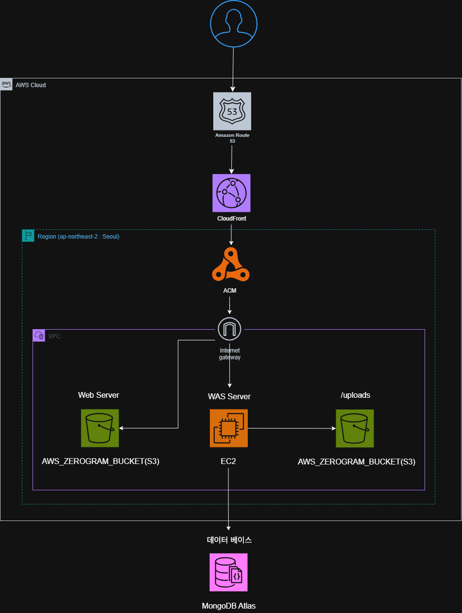

# Zerogram

> 운동인과 입문자를 위한 통합 플랫폼 서비스

Zerogram은 헬스와 러닝 열풍 속에서 운동인과 입문자를 위한 통합 플랫폼 서비스입니다. 체계적인 운동 기록, 칼로리 추적, 운동 메이트 매칭, 실시간 채팅을 제공하여 건강한 운동 라이프스타일을 지원합니다.

## 🌐 배포 정보

**🔗 서비스 URL**: [https://zero-gram.link](https://zero-gram.link)

> 실제 운영 중인 서비스에 접속하여 Zerogram의 모든 기능을 체험해보세요!

## 🏗️ AWS 인프라 아키텍처



### 인프라 구성

- **🌍 CloudFront (CDN)**: 전 세계 사용자에게 빠른 콘텐츠 전송
- **🛣️ Route 53**: DNS 라우팅 및 도메인 관리 (zero-gram.link)
- **🔧 ACM (AWS Certificate Manager)**: SSL/TLS 인증서 관리로 HTTPS 보안 연결
- **🌐 Internet Gateway**: VPC와 인터넷 간 통신 게이트웨이
- **☁️ VPC (Virtual Private Cloud)**: 안전한 클라우드 네트워크 환경
- **💻 EC2 (WAS Server)**: Node.js 백엔드 애플리케이션 서버
- **🌐 Web Server (S3)**: React 프론트엔드 정적 파일 호스팅
- **📦 S3 Buckets**:
  - 웹 서버용 정적 파일 저장소
  - 사용자 업로드 파일(/uploads) 저장소
- **🗄️ MongoDB Atlas**: 사용자 데이터 및 애플리케이션 데이터 저장

### 배포 아키텍처 특징

- **고가용성**: CloudFront CDN을 통한 전 세계 배포
- **보안**: VPC 내 프라이빗 네트워크 구성 및 HTTPS 적용
- **확장성**: Auto Scaling 지원 EC2 인스턴스
- **성능**: CDN 캐싱으로 빠른 로딩 속도
- **비용 효율성**: S3를 활용한 정적 파일 호스팅

## 🚀 주요 기능

### 📝 운동 & 식단 일지

- **달력 기반 운동 기록**: 직관적인 달력 인터페이스로 운동 일정 관리
- **상세한 운동 내용 작성**: 러닝과 헬스 운동을 구분하여 체계적으로 기록
- **칼로리 추적**: 운동별 소모 칼로리 기록 및 관리
- **피드백 시스템**: 운동 후 소감과 감상 기록
- **BMI 계산기**: 신장과 체중을 통한 BMI 자동 계산 및 건강 상태 분석
- **통계 및 차트**: Chart.js를 활용한 월별 칼로리 소모량 및 운동 데이터 시각화

### 🏃‍♂️ 러닝 기능

- **거리 및 페이스 기록**: km 단위 거리와 분:초/km 페이스 기록
- **운동 시간 추적**: 정확한 운동 시간 측정
- **러닝 데이터 분석**: Chart.js를 활용한 시각적 데이터 제공
- **운동 강도 설정**: 개인별 운동 강도 및 목표 설정

### 💪 헬스 기능

- **부위별 운동 루틴**: 가슴, 등, 다리 등 부위별 운동 관리
- **세트/횟수/무게 기록**: 정확한 운동 강도 추적
- **다양한 운동 종목**: 벤치프레스, 스쿼트 등 다양한 헬스 운동 지원
- **운동 루틴 관리**: 개인 맞춤형 운동 루틴 생성 및 관리

### 🍽️ 식단 관리

- **식품 검색 및 칼로리 계산**: 음식별 칼로리 정보 검색 및 자동 계산
- **식단 일지 작성**: 아침, 점심, 저녁, 간식별 식단 기록
- **영양소 추적**: 탄수화물, 단백질, 지방 등 영양소 관리
- **칼로리 목표 설정**: 개인별 일일 칼로리 목표 설정 및 추적

### 🤝 운동 메이트 구하기

- **지역별 필터링**: 강남구, 서초구 등 지역별 운동 파트너 찾기
- **종목별 필터링**: 헬스, 러닝, 테니스 등 관심 종목별 찾기
- **모집글 작성 및 참여**: 운동 그룹 모집 및 참여 기능
- **댓글 및 소통**: 운동 파트너와의 소통 기능
- **이미지 업로드**: 운동 관련 이미지 공유 기능
- **참여자 관리**: 크루 참여/탈퇴 기능

### 💬 실시간 채팅

- **Socket.io 기반 실시간 메시징**: 운동 메이트와의 실시간 소통
- **파일 및 이미지 전송**: 사진, 동영상 등 멀티미디어 파일 공유
- **읽음 상태 표시**: 메시지 읽음/안읽음 상태 실시간 동기화
- **채팅방 관리**: 방 생성, 참여, 나가기 기능
- **알림 시스템**: 새 메시지 알림 및 실시간 푸시 알림
- **모바일 반응형 채팅**: 모바일과 데스크톱 환경에 최적화된 UI

### 👤 사용자 관리

- **다양한 로그인 옵션**: 이메일/비밀번호, Google OAuth, 카카오 OAuth
- **프로필 관리**: 닉네임, 프로필 이미지, 개인정보 관리
- **마이페이지**: 개인 활동 내역 및 설정 관리
- **비밀번호 변경**: 안전한 비밀번호 변경 기능

### 🛡️ 안전한 환경

- **신고 시스템**: 부적절한 게시물 신고 기능
- **관리자 모니터링**: 안전한 커뮤니티 운영
- **세션 관리**: 안전한 사용자 인증 및 세션 관리
- **데이터 보안**: JWT 토큰 기반 인증 및 API 보안

## 🛠️ 기술 스택

### Frontend

- **React 19.1.1** - 사용자 인터페이스 구축
- **TypeScript 4.9.5** - 타입 안전성 보장 및 개발 생산성 향상
- **Styled Components 6.1.19** - CSS-in-JS 스타일링 및 테마 시스템
- **React Router DOM 7.8.2** - 클라이언트 사이드 라우팅 및 페이지 네비게이션
- **Zustand 5.0.8** - 가벼운 상태 관리 (Redux에서 마이그레이션)
- **Chart.js 4.5.0** & **React Chart.js 2** - 데이터 시각화 및 차트 구현
- **React Calendar 6.0.0** - 달력 컴포넌트 및 날짜 선택

### 실시간 통신

- **Socket.io Client 4.8.1** - 실시간 채팅 및 WebSocket 통신
- **WebSocket** - 실시간 메시징 및 알림 시스템

### UI/UX

- **Lucide React 0.544.0** - 아이콘 시스템
- **Styled Reset 4.5.2** - CSS 리셋 및 정규화
- **반응형 디자인** - 모바일/데스크톱 환경 지원

### Backend Integration

- **Axios 1.11.0** - HTTP 클라이언트 및 API 통신
- **RESTful API** - 백엔드 서버와의 데이터 통신
- **JWT 인증** - 토큰 기반 사용자 인증

### 테스팅

- **Jest** - 단위 테스트 및 통합 테스트
- **React Testing Library** - 컴포넌트 테스트
- **Testing Library User Event** - 사용자 상호작용 테스트

### Development Tools

- **Create React App** - 프로젝트 설정 및 빌드 시스템
- **ESLint** - 코드 품질 관리 및 스타일 가이드
- **TypeScript** - 정적 타입 검사 및 개발 도구 지원
- **Webpack** - 모듈 번들링 (CRA 내장)

## 📁 프로젝트 구조

```
src/
├── api/                     # API 통신 모듈
│   ├── auth.ts             # 인증 관련 API (로그인, 회원가입, OAuth)
│   ├── chat.ts             # 채팅 관련 API (메시지, 방 관리)
│   ├── diet.ts             # 식단 관련 API
│   ├── meet.ts             # 운동 메이트 관련 API
│   └── workout.ts          # 운동 기록 관련 API
├── assets/                 # 정적 리소스 (이미지, 폰트 등)
├── components/             # 재사용 가능한 컴포넌트
│   ├── body/              # 신체 관련 컴포넌트
│   │   └── BmiCalculator.tsx
│   ├── chat/              # 실시간 채팅 컴포넌트
│   │   ├── ChatMobile/    # 모바일 채팅 UI
│   │   ├── ChatNotification/ # 채팅 알림 시스템
│   │   ├── ChatSection/   # 채팅 메인 영역
│   │   ├── Sidebar/       # 채팅 사이드바
│   │   └── test/          # 소켓 연결 테스트 컴포넌트
│   ├── common/            # 공통 UI 컴포넌트
│   │   ├── Button.tsx     # 재사용 버튼 컴포넌트
│   │   ├── Card.tsx       # 카드 레이아웃 컴포넌트
│   │   ├── Footer.tsx     # 공통 푸터
│   │   ├── Header.tsx     # 공통 헤더 (네비게이션)
│   │   ├── Input.tsx      # 폼 입력 컴포넌트
│   │   ├── Modal.tsx      # 모달 컴포넌트
│   │   └── Lightbox/      # 이미지 라이트박스
│   ├── diet/              # 식단 관련 컴포넌트
│   │   ├── CalorieChart.tsx
│   │   ├── DietLogModal.tsx
│   │   └── FoodSearch.tsx
│   ├── home/              # 홈페이지 컴포넌트
│   │   ├── CombinedCalorieChart.tsx
│   │   ├── DietLogCard.tsx
│   │   ├── MeetCard.tsx
│   │   └── WorkoutLogCard.tsx
│   ├── meet/              # 운동 메이트 관련 컴포넌트
│   │   ├── ImageUpload.tsx
│   │   ├── LocationFilter.tsx
│   │   ├── MeetCard.tsx
│   │   ├── MeetDetailModal.tsx
│   │   ├── MeetForm.tsx
│   │   ├── SearchBar.tsx
│   │   └── WorkoutFilter.tsx
│   └── workout/           # 운동 관련 컴포넌트
│       ├── WorkoutCalorieChart.tsx
│       ├── WorkoutDetailModal.tsx
│       ├── WorkoutForm.tsx
│       └── WorkoutList.tsx
├── constants/             # 상수 정의
│   ├── api.ts            # API 엔드포인트 및 설정
│   ├── auth.ts           # 인증 관련 상수
│   ├── chat.ts           # 채팅 관련 상수
│   ├── ui.ts             # UI 관련 상수 (색상, 크기 등)
│   ├── validation.ts     # 폼 검증 상수
│   └── index.ts          # 통합 export
├── contexts/             # React Context API (필요시)
├── data/                 # 정적 데이터
│   └── food.json         # 음식 데이터베이스
├── hooks/                # 커스텀 훅
│   ├── useFoodSearch.ts  # 음식 검색 훅
│   ├── useInfiniteScroll.ts # 무한 스크롤 훅
│   ├── useIsNarrow.ts    # 반응형 디자인 훅
│   ├── useSocket.ts      # Socket.io 훅
│   └── zustand.ts        # Zustand 호환성 훅
├── mocks/                # 개발용 목 데이터
│   └── meetData.ts
├── pages/                # 페이지 컴포넌트
│   ├── chat/             # 채팅 관련 페이지
│   │   ├── ChatIndex/    # 채팅 메인 페이지
│   │   └── ChatPage/     # 채팅 상세 페이지
│   ├── DietLogPage.tsx   # 식단 일지 페이지
│   ├── HomePage.tsx      # 메인 홈페이지
│   ├── LandingPage.tsx   # 랜딩 페이지
│   ├── LoginPage.tsx     # 로그인 페이지
│   ├── MeetPage.tsx      # 운동 메이트 페이지
│   ├── MyPage.tsx        # 마이페이지
│   ├── SignupPage.tsx    # 회원가입 페이지
│   └── WorkoutLogPage.tsx # 운동 일지 페이지
├── providers/            # Context 프로바이더
│   ├── ChatNotifyProvider.tsx # 채팅 알림 프로바이더
│   ├── SocketProvider.tsx     # Socket 연결 프로바이더
│   └── index.ts
├── router/               # 라우팅 설정
│   └── Router.tsx        # 애플리케이션 라우터 설정
├── store/                # 상태 관리 (Zustand)
│   ├── authStore.ts      # 인증 상태 관리
│   ├── chatStore.ts      # 채팅 상태 관리
│   ├── dietStore.ts      # 식단 상태 관리
│   ├── meetStore.ts      # 운동 메이트 상태 관리
│   ├── userStore.ts      # 사용자 정보 관리
│   ├── workoutStore.ts   # 운동 데이터 관리
│   └── index.ts          # 스토어 통합 export
├── styles/               # 전역 스타일
│   ├── GlobalStyle.ts    # 전역 CSS 스타일
│   └── index.ts
├── types/                # TypeScript 타입 정의
│   ├── chat/             # 채팅 관련 타입
│   │   ├── chat.ts       # 채팅 메시지, 사용자 타입
│   │   ├── notify.ts     # 알림 관련 타입
│   │   ├── room.ts       # 채팅방 관련 타입
│   │   └── index.ts
│   ├── body.ts           # 신체 정보 타입
│   ├── common.ts         # 공통 타입 정의
│   ├── diet.ts           # 식단 관련 타입
│   ├── meet.ts           # 운동 메이트 타입
│   ├── user.ts           # 사용자 타입
│   ├── workout.ts        # 운동 관련 타입
│   └── index.ts          # 타입 통합 export
└── utils/                # 유틸리티 함수
    ├── chat/             # 채팅 관련 유틸
    │   ├── date.ts       # 날짜 처리
    │   ├── eventBus.ts   # 이벤트 버스
    │   ├── files.ts      # 파일 처리
    │   ├── mappers.ts    # 데이터 변환
    │   ├── normalizeAscending.ts # 정렬 유틸
    │   ├── rooms.ts      # 채팅방 유틸
    │   ├── socket.ts     # Socket.io 관리
    │   └── index.ts
    ├── auth.ts           # 인증 관련 유틸리티
    ├── error.ts          # 에러 처리 유틸리티
    ├── oauth.ts          # OAuth 처리 유틸리티
    ├── string.ts         # 문자열 처리 유틸리티
    ├── validation.ts     # 폼 검증 유틸리티
    └── index.ts          # 유틸리티 통합 export
```

## 🚀 시작하기

### 필수 요구사항

- Node.js 16.0.0 이상
- npm 7.0.0 이상

### 설치 및 실행

1. **저장소 클론**

   ```bash
   git clone <repository-url>
   cd client
   ```

2. **의존성 설치**

   ```bash
   npm install
   ```

### 3. 환경 변수 설정

프로젝트 루트에 `.env` 파일을 생성하고 다음 환경 변수를 설정하세요:

#### 개발 환경 (.env.development)

```bash
# 백엔드 API 서버 주소 (로컬 개발)
REACT_APP_API_BASE_URL=http://localhost:4000

# Socket.io 서버 설정 (로컬 개발)
REACT_APP_SOCKET_URL=http://localhost:4000
REACT_APP_SOCKET_PATH=/ws
REACT_APP_SOCKET_NAMESPACE=/
REACT_APP_SOCKET_AUTO_CONNECT=true
REACT_APP_SOCKET_RECONNECTION_ATTEMPTS=Infinity
REACT_APP_SOCKET_RECONNECTION_DELAY=500
REACT_APP_SOCKET_RECONNECTION_DELAY_MAX=3000
REACT_APP_SOCKET_TIMEOUT=10000

# OAuth 설정 (선택사항)
REACT_APP_GOOGLE_CLIENT_ID=your_google_client_id
REACT_APP_KAKAO_CLIENT_ID=your_kakao_client_id
```

#### 프로덕션 환경 (.env.production)

```bash
# 백엔드 API 서버 주소 (AWS EC2)
REACT_APP_API_BASE_URL=https://api.zero-gram.link

# Socket.io 서버 설정 (프로덕션)
REACT_APP_SOCKET_URL=https://api.zero-gram.link
REACT_APP_SOCKET_PATH=/ws
REACT_APP_SOCKET_NAMESPACE=/
REACT_APP_SOCKET_AUTO_CONNECT=true
REACT_APP_SOCKET_RECONNECTION_ATTEMPTS=Infinity
REACT_APP_SOCKET_RECONNECTION_DELAY=500
REACT_APP_SOCKET_RECONNECTION_DELAY_MAX=3000
REACT_APP_SOCKET_TIMEOUT=10000

# OAuth 설정 (프로덕션)
REACT_APP_GOOGLE_CLIENT_ID=your_production_google_client_id
REACT_APP_KAKAO_CLIENT_ID=your_production_kakao_client_id
```

4. **개발 서버 실행**

   ```bash
   npm start
   ```

   브라우저에서 [http://localhost:3000](http://localhost:3000)을 열어 확인하세요.

5. **프로덕션 빌드**
   ```bash
   npm run build
   ```

## 📱 사용법

### 1. 회원가입 및 로그인

- 이메일/비밀번호로 회원가입
- Google 또는 카카오 계정으로 소셜 로그인
- OAuth 인증 후 자동 세션 관리

### 2. 운동 기록하기

- 달력에서 원하는 날짜 선택
- "일지 작성" 버튼 클릭
- 러닝 또는 헬스 운동 선택
- 운동 세부사항 입력 (시간, 칼로리, 거리, 페이스 등)
- 피드백 작성 후 저장

### 3. 식단 관리

- 식단 일지 페이지에서 날짜 선택
- 아침/점심/저녁/간식 별로 음식 추가
- 음식 검색을 통한 칼로리 자동 계산
- 일일 칼로리 목표 대비 섭취량 추적

### 4. 운동 메이트 찾기

- 지역별/종목별 필터링으로 원하는 운동 파트너 검색
- 모집글 작성 및 참여 신청
- 댓글을 통한 소통 및 정보 교환
- 크루 참여로 정기적인 운동 모임 관리

### 5. 실시간 채팅

- 운동 메이트와의 실시간 소통
- 이미지, 파일 전송 지원
- 모바일/데스크톱 환경에 최적화된 UI
- 읽음/안읽음 상태 실시간 동기화

### 6. 운동 데이터 분석

- 월별 운동 데이터 차트로 시각화
- 칼로리 소모량 추이 분석
- BMI 계산 및 건강 상태 모니터링
- 개인 운동 기록 통계

### 7. 프로필 관리

- 마이페이지에서 개인정보 수정
- 프로필 이미지 업로드 및 변경
- 비밀번호 변경 (일반 회원가입 사용자)
- 계정 설정 및 알림 관리

## 🔧 개발 가이드

### 상태 관리 (Zustand)

이 프로젝트는 Redux에서 Zustand로 마이그레이션되었습니다. 자세한 내용은 [MIGRATION_GUIDE.md](./MIGRATION_GUIDE.md)를 참고하세요.

```typescript
// Zustand 스토어 사용 예시
import { useAuthStore, useUserStore } from "../store";

const MyComponent = () => {
  const { isLoggedIn, login, logout } = useAuthStore();
  const { nickname, fetchUserInfo } = useUserStore();

  // 액션 호출
  const handleLogin = async () => {
    await login(credentials);
    fetchUserInfo();
  };
};
```

### 실시간 채팅 시스템

Socket.io를 사용한 실시간 채팅 시스템:

```typescript
// Socket 연결 및 메시지 송수신
import { useSocket } from "../hooks/useSocket";
import { sendMessage, onNewMessage } from "../utils/chat";

const ChatComponent = () => {
  const socket = useSocket();

  useEffect(() => {
    const unsubscribe = onNewMessage((message) => {
      // 새 메시지 처리
    });

    return unsubscribe;
  }, []);
};
```

### API 통신

- 모든 API 호출은 `src/api/` 디렉토리에서 관리
- Axios 인터셉터를 통한 자동 인증 헤더 추가
- 에러 핸들링 및 로깅 시스템 구축

```typescript
// API 사용 예시
import { authApi } from "../api/auth";
import { getWorkoutListApi } from "../api/workout";

const fetchData = async () => {
  try {
    const userInfo = await authApi.getUserInfo();
    const workouts = await getWorkoutListApi();
  } catch (error) {
    // 에러 처리
  }
};
```

### 컴포넌트 구조

- **재사용 가능한 컴포넌트**: `src/components/common/`
- **기능별 컴포넌트**: `src/components/{feature}/`
- **페이지 컴포넌트**: `src/pages/`

### 스타일링

- Styled Components를 사용한 CSS-in-JS 방식
- 일관된 디자인 시스템을 위한 상수 정의 (`src/constants/ui.ts`)
- 반응형 디자인 지원

```typescript
// 스타일링 예시
import styled from "styled-components";
import { UI_CONSTANTS } from "../constants";

const StyledButton = styled.button`
  background-color: ${UI_CONSTANTS.COLORS.PRIMARY};
  padding: ${UI_CONSTANTS.SPACING.MD};
  border-radius: ${UI_CONSTANTS.BORDER_RADIUS.MD};
`;
```

### 타입 안전성

- TypeScript를 활용한 강타입 시스템
- API 응답, 컴포넌트 props, 상태 등 모든 데이터에 타입 정의
- 컴파일 타임 에러 검출로 런타임 에러 최소화

### 테스팅

```bash
# 테스트 실행
npm test

# 커버리지 포함 테스트
npm test -- --coverage
```

## 📋 주요 특징

### 🏗️ 아키텍처

- **모듈화된 구조**: 기능별로 분리된 컴포넌트 및 모듈 구조
- **관심사 분리**: API, 상태 관리, UI 컴포넌트의 명확한 분리
- **확장 가능한 설계**: 새로운 기능 추가가 용이한 구조

### 🚀 성능 최적화

- **코드 분할**: React.lazy를 통한 지연 로딩
- **무한 스크롤**: 대용량 데이터의 효율적 로딩
- **메모이제이션**: React.memo, useMemo를 통한 렌더링 최적화
- **이미지 최적화**: 이미지 압축 및 지연 로딩

### 📱 반응형 디자인

- **모바일 우선**: 모바일 환경을 고려한 UI/UX 설계
- **크로스 플랫폼**: 다양한 디바이스에서 일관된 사용자 경험
- **터치 친화적**: 모바일 터치 인터페이스 최적화

### 🔐 보안

- **JWT 토큰**: 안전한 사용자 인증 시스템
- **HTTPS 지원**: 안전한 데이터 전송
- **입력 검증**: 클라이언트 및 서버 단에서의 데이터 검증
- **XSS 방지**: 사용자 입력 데이터 안전성 확보

### 🌐 국제화 지원

- **다국어 지원 준비**: i18n 구조 준비
- **날짜/시간 현지화**: 지역별 날짜 형식 지원

## 🚦 라이프사이클 및 상태 관리

### Zustand 스토어 구조

```typescript
// 스토어별 책임 분리
- authStore: 인증 상태 (로그인/로그아웃)
- userStore: 사용자 정보 관리
- workoutStore: 운동 데이터 관리
- dietStore: 식단 데이터 관리
- meetStore: 운동 메이트 관리
- chatStore: 실시간 채팅 상태 관리
```

### 데이터 플로우

```
사용자 액션 → 컴포넌트 → Zustand Store → API 호출 → 서버
             ↓
UI 업데이트 ← Store 상태 변경 ← API 응답 ← 서버 응답
```

## 🚀 배포 가이드

### 프론트엔드 배포 (AWS S3 + CloudFront)

1. **빌드 생성**

   ```bash
   npm run build
   ```

2. **S3 버킷에 업로드**

   - AWS S3 콘솔에서 `AWS_ZEROGRAM_BUCKET(S3)` 버킷 접근
   - `build/` 폴더의 모든 파일을 버킷에 업로드
   - 정적 웹사이트 호스팅 설정 활성화

3. **CloudFront 배포**

   - CloudFront 배포를 통해 전 세계 CDN 적용
   - 캐시 무효화(Cache Invalidation) 수행

4. **Route 53 도메인 연결**
   - `zero-gram.link` 도메인을 CloudFront 배포에 연결
   - SSL/TLS 인증서 자동 적용

### 백엔드 배포 (AWS EC2)

- Node.js 백엔드 서버는 EC2 인스턴스에서 운영
- MongoDB Atlas와 연결하여 데이터 관리
- Socket.io를 통한 실시간 통신 지원

### CI/CD 파이프라인

```bash
# 자동 배포 스크립트 예시
npm run build
aws s3 sync build/ s3://aws-zerogram-bucket --delete
aws cloudfront create-invalidation --distribution-id YOUR_DISTRIBUTION_ID --paths "/*"
```

## 🔧 운영 환경 모니터링

### 성능 지표

- **로딩 속도**: CloudFront CDN을 통한 빠른 콘텐츠 전송
- **가용성**: 99.9% 업타임 목표
- **확장성**: Auto Scaling 그룹을 통한 자동 확장

### 보안 조치

- **HTTPS 강제**: 모든 트래픽 SSL/TLS 암호화
- **CORS 정책**: 안전한 도메인 간 요청 관리
- **JWT 토큰**: 안전한 사용자 인증 시스템

## 🤝 기여하기

2. Create your Feature Branch (`git checkout -b feature/AmazingFeature`)
3. Commit your Changes (`git commit -m 'Add some AmazingFeature'`)
4. Push to the Branch (`git push origin feature/AmazingFeature`)
5. Open a Pull Request

## 📞 문의

프로젝트에 대한 문의사항이 있으시면 이슈를 생성해 주세요.

---

**🎯 [Zerogram 바로 사용해보기](https://zero-gram.link)**

**Zerogram**과 함께 건강한 운동 라이프를 시작하세요! 💪

> 실시간 채팅으로 운동 메이트와 소통하고, 체계적인 운동/식단 기록으로 목표를 달성하세요!

**Zerogram**과 함께 건강한 운동 라이프를 시작하세요! 💪
